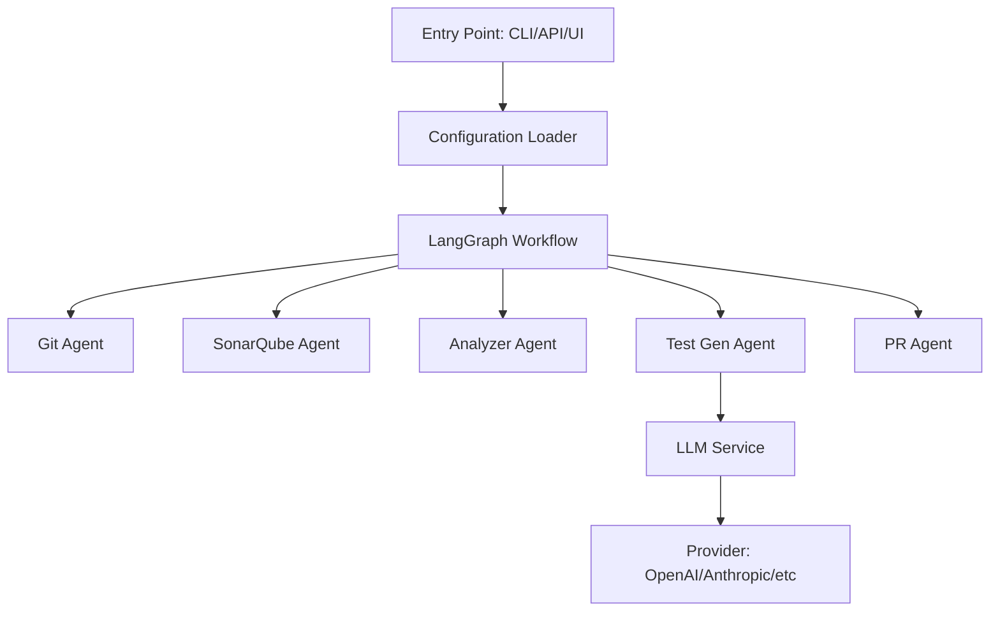

# Code Coverage Agent

A modular, LangGraph-based agentic system that automates code coverage improvement by orchestrating specialized agents to clone repositories, analyze coverage, generate tests, and submit pull requests.

## Features

- **🤖 Reusable Agents**: Modular agents for Git operations, SonarQube integration, code analysis, test generation, and PR creation
- **🔄 LangGraph Workflow**: State-based workflow with conditional branching based on coverage thresholds
- **🧠 LLM Abstraction**: Provider-agnostic LLM service layer (OpenAI, Anthropic, Azure OpenAI, etc.)
- **🔌 Azure DevOps Integration**: Native support for Azure DevOps Repos and Pull Requests
- **🌐 RESTful API**: FastAPI endpoints for external system integration
- **💬 Interactive UI**: Streamlit-based chat interface for workflow configuration and monitoring
- **⚙️ Highly Configurable**: YAML-based configuration with environment variable support

## Architecture



## Quick Start

### Prerequisites

- Python 3.10+
- UV package manager (recommended) or pip
- Azure DevOps PAT with Code and PR permissions
- SonarQube server access
- LLM API key (OpenAI, Anthropic, etc.)

### Installation

#### Using UV (Recommended)

```bash
# Install UV
powershell -c "irm https://astral.sh/uv/install.ps1 | iex"

# Clone and setup
git clone <your-repo-url> code-coverage-agent
cd code-coverage-agent
uv sync

# Install with dev dependencies
uv sync --extra dev
```

#### Using pip

```bash
cd code-coverage-agent
pip install -e .

# With dev dependencies
pip install -e ".[dev]"
```

### Configuration

1. Copy the environment template:
```bash
cp .env.example .env
```

2. Edit `.env` with your credentials:
```bash
# Azure DevOps
AZURE_DEVOPS_ORG_URL=https://dev.azure.com/yourorg
AZURE_DEVOPS_PROJECT=YourProject
AZURE_DEVOPS_PAT=your_pat_token

# SonarQube
SONAR_URL=https://sonarqube.example.com
SONAR_TOKEN=your_sonar_token
SONAR_PROJECT_KEY=your_project_key

# LLM Provider
OPENAI_API_KEY=your_openai_key
```

3. (Optional) Customize `config/default.yaml` for workflow settings

## Usage

### CLI Mode

```bash
# Using UV
uv run python main.py --repo https://dev.azure.com/org/project/_git/repo \
  --sonar-key my-project \
  --threshold 90

# Using Python
python main.py --repo <repo-url> --config config/default.yaml
```

### API Mode

Start the FastAPI server:

```bash
# Using UV
uv run uvicorn src.api.main:app --host 0.0.0.0 --port 8000 --reload

# Using Python
uvicorn src.api.main:app --reload
```

Start a workflow via API:

```bash
curl -X POST http://localhost:8000/api/workflow/start \
  -H "Content-Type: application/json" \
  -d '{
    "repo_url": "https://dev.azure.com/org/project/_git/repo",
    "sonar_project_key": "my-project",
    "coverage_threshold": 90
  }'
```

Check workflow status:

```bash
curl http://localhost:8000/api/workflow/{workflow_id}
```

API documentation available at: `http://localhost:8000/docs`

### UI Mode

Launch the Streamlit chat interface:

```bash
# Using UV
uv run streamlit run src/ui/app.py --server.port 8501

# Using Python
streamlit run src/ui/app.py
```

Access the UI at: `http://localhost:8501`

## Project Structure

```
code-coverage-agent/
├── src/
│   ├── agents/          # Reusable agent implementations
│   ├── llm/             # LLM service abstraction
│   ├── workflow/        # LangGraph workflow
│   ├── api/             # FastAPI application
│   ├── ui/              # Streamlit UI
│   ├── config/          # Configuration management
│   └── utils/           # Shared utilities
├── config/              # Configuration files
├── tests/               # Test suite
├── main.py              # CLI entry point
└── pyproject.toml       # Dependencies
```

## Configuration

See `config/example.yaml` for all available options:

- Git provider settings (Azure DevOps)
- SonarQube connection
- LLM provider configuration
- Workflow parameters (retries, timeouts, etc.)
- API and UI settings

## Extending the System

### Adding a New LLM Provider

1. Create `src/llm/providers/your_provider.py`
2. Implement `BaseLLMProvider` interface
3. Register in `src/llm/factory.py`
4. Update configuration schema

### Adding a New Agent

1. Create agent in `src/agents/your_agent.py`
2. Inherit from `BaseAgent`
3. Implement `execute()` method
4. Integrate into workflow graph

## Development

### Running Tests

```bash
# All tests
uv run pytest tests/ -v --cov=src

# Specific test suite
uv run pytest tests/agents/
uv run pytest tests/api/
```

### Code Quality

```bash
# Format code
uv run black src/ tests/

# Lint
uv run ruff check src/ tests/

# Type checking
uv run mypy src/
```

## Workflow

1. **Clone Repository**: Git agent clones the target repository
2. **Check Coverage**: SonarQube agent fetches current coverage metrics
3. **Decision Point**: If coverage < threshold, proceed; else exit
4. **Analyze Code**: Analyzer identifies uncovered functions/classes
5. **Generate Tests**: Test generator creates unit tests using LLM
6. **Create PR**: PR agent submits pull request with generated tests

## Troubleshooting

- **Authentication Issues**: Verify Azure DevOps PAT has correct permissions
- **SonarQube Connection**: Check firewall and API token validity
- **LLM Errors**: Verify API key and check rate limits
- **UV Installation**: May require execution policy adjustment on Windows

## License

MIT

## Contributing

Contributions welcome! Please open an issue or PR.
